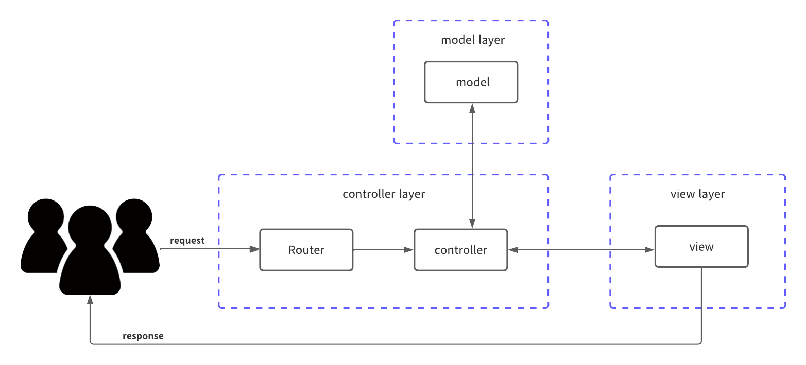

# introduction

このリポジトリは、MVCモデルで作成されたSample WEB Applicationです。 本プログラムは、Go言語のWEB Application Framework Gin を利用して作成されています。

## MVCとは？



## ディレクトリ構造

### 全体のディレクトリ構成

```terminal:全体のディレクトリ構成
├── application/
├── infra/
```

`application/`: Web Applicationに関するコードが格納されています。

`infra/`: infraに関するコードが格納されています。

## 本プログラムの実行方法

### dockerを使ってアプリケーションを立ち上げる場合

```terminal:terminal
>　docker-compose build
>　docker-compose up -d
```

### dockerを使わずにアプリケーションを起動させる場合

<br>
(備考)

ローカルでアプリケーションを実行する際には、.envファイルを読み込む必要があります。

`/application`配下に`.env`ファイルを作成します。

```:.env
MYSQL_ROOT_ID=root
MYSQL_ROOT_PASSWORD=pass
MYSQL_HOST=localhost
MYSQL_PORT=3306
MYSQL_DATABASE=test
```

### 起動方法

1. DBは、docker containerで起動させる。

```terminal:terminal
> docker-compose -f infra/mysql.yaml build
> docker-compose -f infra/mysql.yaml up -d
```

2. アプリケーションを起動させる。

```terminal:アプリケーションの起動方法
> go run main.go
```

### DBのマイグレーション

アプリケーションを初回実行した場合にはDBにマイグレーションを行う必要があります。

```terminal:
# application配下まで移動する
> application/tools/run_migration.sh -v <migration version> -e root:pass@localhost:3306/test -f migration/
```

## 参考文献

後日記入
