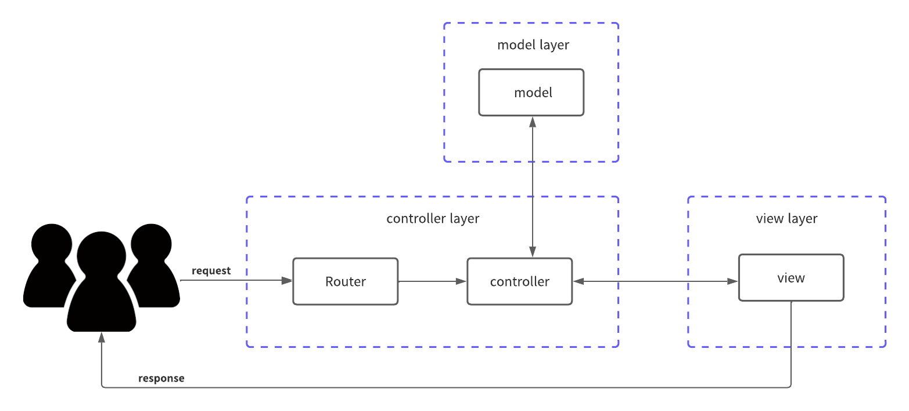

[日本語](README-jp.md)

# introduction

This repository is a Sample WEB Application created in the MVC model. This program was created using the WEB Application Framework Gin of the Go language.

## What is MVC?



## Directory Structures

### Overall directory organization

```terminal:Overall directory structure
├── application/
├── infra/
```

`application/`: The code related to Web Application is stored.

`infra/`: Codes related to infra are stored.

## How to execute this program

### When launching an application using docker

```terminal:terminal
> docker-compose build
> docker-compose up -d
```

### To launch an application without docker

<br>
(Remarks.)

When running the application locally, you will need to load the .env file.

Create a `.env` file under `/application`.

```:.env
MYSQL_ROOT_ID=root
MYSQL_ROOT_PASSWORD=pass
MYSQL_HOST=localhost
MYSQL_PORT=3306
MYSQL_DATABASE=test
```

### Activation Method

1. DB is started by docker container.

```terminal:terminal
> docker-compose -f infra/mysql.yaml build
> docker-compose -f infra/mysql.yaml up -d
```

2. Launch the application.

```terminal:Launch the application
> go run main.go
```

### DB Migration

When the application is run for the first time, it is necessary to perform migration to the DB.

```terminal:
# migrate to the application directory.
> application/tools/run_migration.sh -v <migration version> -e root:pass@localhost:3306/test -f migration/
```

## References

to be filled in later
